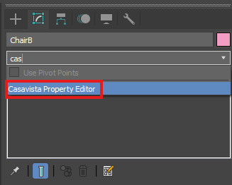
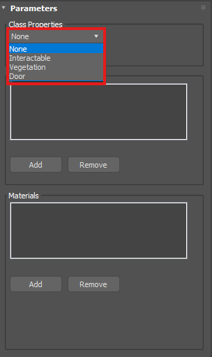
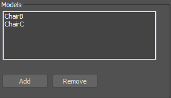
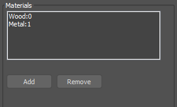
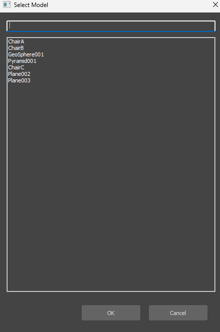
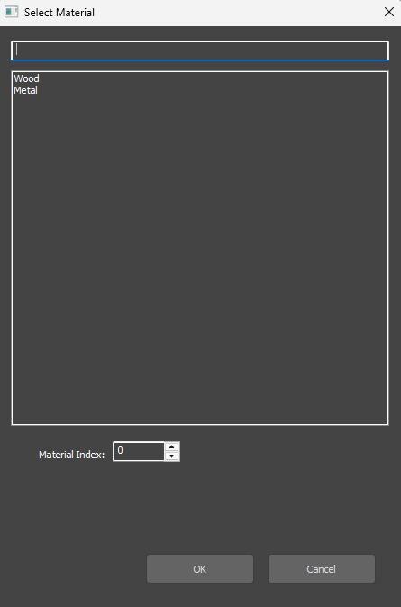
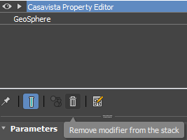
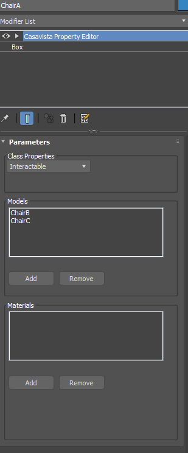
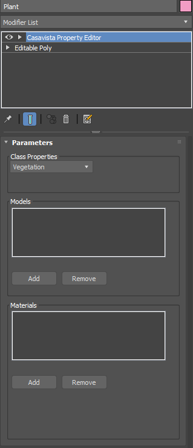
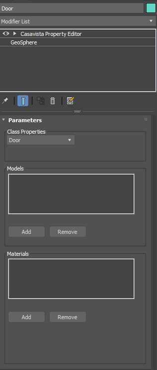

# Casavista Plugin — Designer Guide

For designers who already use 3ds Max. This guide covers **only what you need for the Casavista modifier** so your scene exports correctly to Unreal (Datasmith/Dataprep): interactables can swap models, materials can target the right part of a mesh, vegetation is tagged, and doors open from the correct hinge.

## What the plugin does

Casavista is a **modifier** that tags objects for the Unreal pipeline. You add it, set **Class**, and where needed fill **Models** or **Materials** and set **pivots**. The rest is standard Max; this guide only covers the Casavista-specific choices.

---

## Adding the Casavista modifier

Add **Casavista Property Editor** from the Modifier List (it may appear under a category like "DCG Samples"). The modifier adds a rollout with **Class**, **Models**, and **Materials**. See Figure 1.

**Figure 1.** Casavista Property Editor in the Modifier List.

---

## The Casavista rollout

Three areas control how the object is tagged:

### 1. Class

**Class** dropdown: **None**, **Interactable**, **Vegetation**, **Door**. Pick the one that matches the object. **None** is only a placeholder—if you don’t need the modifier on that object, remove the modifier instead of leaving Class on None. See Figure 2.

**Figure 2.** Class options.

### 2. Models

A list plus **Add** / **Remove**. Use it when the object can **swap to other mesh variants** (e.g. one chair slot that can be Chair A, B, or C). The object that has the modifier is the **main** one; add **only the other variants** to the list (e.g. Chair_B, Chair_C—not the main chair). See Figure 3.

**Figure 3.** Models list and Add / Remove.

### 3. Materials

A list plus **Add** / **Remove**. Use it when the **shape stays the same** but you want to drive **specific parts** (e.g. only the tabletop). You pick a material and a **Material Id** (0, 1, 2, …) so the pipeline knows which part to change. See Figure 4.

**Figure 4.** Materials list and Add / Remove.

---

## Adding models (Models list)

**When:** Class = **Interactable** and you want alternative mesh options.

- **Add** opens the **Model Select** dialog: search box at top, scene objects below. Use the search to filter, select the **alternative** meshes only (not the object that has the modifier), then **OK**. Names appear in the Models list; **Remove** takes them off. See Figure 19.

**Figure 19.** Model Select dialog.

---

## Adding materials (Materials list)

**When:** Same shape, but you want to drive **specific parts** (e.g. tabletop only).

- **Add** opens the **Material Select** dialog: pick a material from the list (search if needed), set **Material Id** (0, 1, 2, …) for the part you want, then **OK**. Entry shows as e.g. `Wood_Material (Index: 0)`. **Remove** takes entries off. You need the correct index for each part (see "Material Id" below). See Figure 20.

**Figure 20.** Material Select dialog.

---

## Class: what to set and when

### None

**None** = no class chosen yet. If the object doesn't need Casavista at all (no swap, no material drive, not vegetation, not a door), **remove the modifier** instead of leaving Class on None. See Figure 21.

**Figure 21.** Removing the Casavista modifier.

---

### Interactable

**Use for:** Objects that can **swap to other mesh variants** in Unreal (e.g. one chair slot that can be Chair A, B, or C). The object with the modifier is the **main**; the Models list must contain **only the other variants**, not the main one.

- Add Casavista → **Class** = **Interactable** → **Add** under Models → in Model Select, pick only the alternative meshes → OK.
- **Pivots:** Main and every mesh in the Models list must share the **same pivot position** (e.g. seat center or base). If they don't, the swap will be misaligned in Unreal. Align with **Affect Pivot Only** (see "Pivots" below). See Figures 5–6, 10–11.

**Figure 5.** Interactable: main object + Models list with alternatives only.

**Figure 6.** Same pivot.

---

### Vegetation

**Use for:** Plants, trees, bushes, grass, etc. Add Casavista → **Class** = **Vegetation**. No Models or Materials needed. Use **real geometry** (no proxies). See Figure 7.

**Figure 7.** Vegetation: Class = Vegetation only.

---

### Door

**Use for:** Doors that open/close in Unreal. The door must be **one mesh** (panel + frame + handle attached). Add Casavista → **Class** = **Door**. **Pivot** must be on the **hinge edge** (the edge that doesn't move when the door opens). Set it with **Affect Pivot Only** (see [Figure 6. Same pivot](#figure-6) below).

**Figure 8.** Door: single mesh, Class = Door.

---

## Pivots (Casavista rules)

- **Interactable:** Main object and every mesh in the Models list must have the **same pivot position** (e.g. seat center or base) so swaps line up in Unreal.
- **Door:** Pivot must be on the **hinge edge** (the edge that stays fixed when the door opens). Rotate in Max to confirm it swings correctly.

**How:** Hierarchy → **Affect Pivot Only** → move pivot (or Align to main/door edge) → turn **Affect Pivot Only** off. 

---

## Material Id

**What it is:** Multi/Sub-Object (or similar) slots are numbered 0, 1, 2, … In Casavista Materials you pick a material and an **index** so the pipeline knows which part of the mesh to change (e.g. 0 = tabletop, 1 = legs).

**Finding the index:** Sub-material order in the mat editor = index order (first = 0, second = 1, …). If unsure, give each sub-material a different color and check which part on the model is which; use that number in Material Select.

---

## Quick reference

| Class            | Use for                                                     | Models list                                               | Materials list | Pivot / geometry                                  |
| ---------------- | ----------------------------------------------------------- | --------------------------------------------------------- | -------------- | ------------------------------------------------- |
| **None**         | Placeholder only; if you don't need the modifier, remove it | —                                                        | —             | —                                                |
| **Interactable** | Objects that swap model variants                            | Add **only** the alternative options (not the main object) | Optional       | Align pivots of all alternatives with main object |
| **Vegetation**   | Plants, trees, bushes                                       | Leave empty                                               | Leave empty    | Plain geometry, no proxies                        |
| **Door**         | Doors that open/close                                       | Leave empty                                               | Optional       | Single merged mesh; pivot on hinge edge           |
